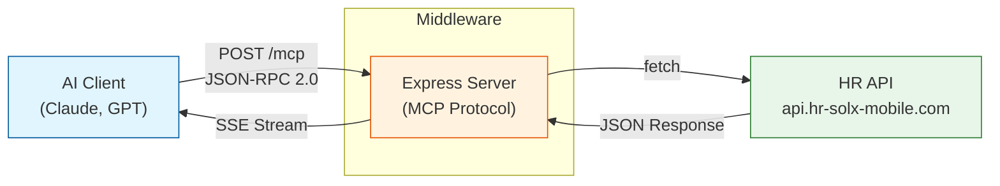
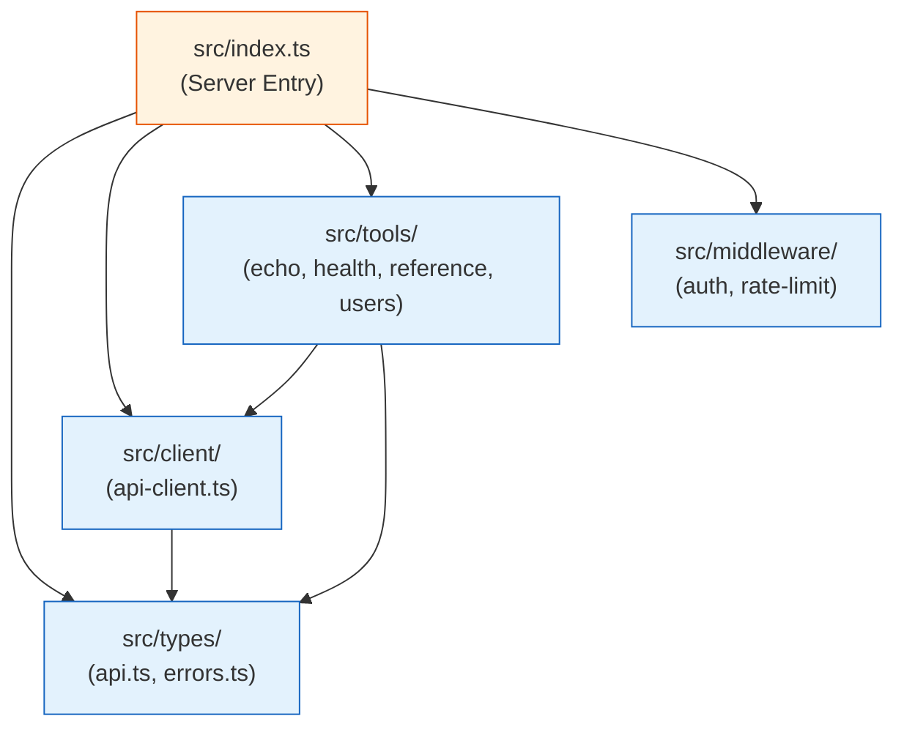

# HR Solx MCP Server

A [Model Context Protocol (MCP)](https://modelcontextprotocol.io) server that exposes HR API endpoints as AI-accessible tools. Built with Express.js and the official MCP SDK.

## What It Does

This server acts as a bridge between AI models (Claude, GPT, etc.) and the HR Solx REST API. AI clients can discover and invoke tools through the MCP protocol, enabling natural language interactions with HR data like users, countries, skills, roles, and more.

## Features

- **12 MCP Tools** — Health checks, geographic data, reference data, and user management
- **Streamable HTTP Transport** — Stateless JSON-RPC 2.0 communication
- **TypeScript** — Full type safety with Zod validation
- **Modular Architecture** — Organized codebase with separated concerns
- **Authentication** — API key protection for MCP endpoint
- **Rate Limiting** — IP-based request throttling
- **Error Handling** — Typed errors with contextual messages

## System Architecture



## Quick Start

```bash
npm install
npm run dev
```

Server runs at `http://localhost:4000/mcp`

## Environment Variables

| Variable | Default | Description |
|----------|---------|-------------|
| `MCP_SERVER_PORT` | `4000` | Server listening port |
| `MCP_API_URL` | `https://api.hr-solx-mobile.com` | Upstream HR API URL |
| `MCP_API_KEY` | — | API key to protect MCP endpoint |
| `API_TOKEN` | — | Bearer token for upstream API auth |
| `RATE_LIMIT_WINDOW_MS` | `900000` | Rate limit window (15 min) |
| `RATE_LIMIT_MAX_REQUESTS` | `100` | Max requests per window |

Copy `.env.example` to get started:
```bash
cp .env.example .env
```

## Available Tools

### Health Checks
| Tool | Description |
|------|-------------|
| `basic-health-check` | Check if API is reachable |
| `detailed-health-check` | Comprehensive system health |

### Geographic Data
| Tool | Description |
|------|-------------|
| `get-countries` | List all countries |
| `get-states` | List all states |
| `get-cities` | List all cities |

### Reference Data
| Tool | Description |
|------|-------------|
| `get-skills` | List available skills |
| `get-languages` | List available languages |
| `get-working-statuses` | List working statuses |
| `get-roles` | List available roles |

### User Management
| Tool | Description | Params |
|------|-------------|--------|
| `get-users` | List all users | — |
| `create-user` | Create a new user | name, email, mobile |

## Usage Examples

### List Available Tools

```bash
curl -X POST http://localhost:4000/mcp \
  -H "Content-Type: application/json" \
  -H "Accept: application/json, text/event-stream" \
  -d '{"jsonrpc":"2.0","method":"tools/list","params":{},"id":1}'
```

### Call a Tool

```bash
curl -X POST http://localhost:4000/mcp \
  -H "Content-Type: application/json" \
  -H "Accept: application/json, text/event-stream" \
  -d '{
    "jsonrpc": "2.0",
    "method": "tools/call",
    "params": {
      "name": "get-users",
      "arguments": {}
    },
    "id": 1
  }'
```

### Create a User

```bash
curl -X POST http://localhost:4000/mcp \
  -H "Content-Type: application/json" \
  -H "Accept: application/json, text/event-stream" \
  -d '{
    "jsonrpc": "2.0",
    "method": "tools/call",
    "params": {
      "name": "create-user",
      "arguments": {
        "name": "John Doe",
        "email": "john@example.com",
        "mobile": "+1234567890"
      }
    },
    "id": 1
  }'
```

### With Authentication

```bash
curl -X POST http://localhost:4000/mcp \
  -H "Content-Type: application/json" \
  -H "Accept: application/json, text/event-stream" \
  -H "X-API-Key: your-api-key" \
  -d '{"jsonrpc":"2.0","method":"tools/list","params":{},"id":1}'
```

## Project Structure

```
├── docs/                          # Detailed documentation
│   ├── ARCHITECTURE.md            # System architecture & design
│   ├── MCP-PROTOCOL.md            # MCP protocol guide
│   ├── TOOLS-REFERENCE.md         # Complete tool catalog
│   ├── DEVELOPER-GUIDE.md         # How to extend & test
│   ├── SECURITY.md                # Security considerations
│   ├── TROUBLESHOOTING.md         # Common issues & fixes
│   └── REQUEST-FLOW.md            # Request lifecycle
├── src/
│   ├── index.ts                   # Server entry point
│   ├── types/
│   │   ├── api.ts                 # API response interfaces
│   │   └── errors.ts              # Custom error types
│   ├── client/
│   │   └── api-client.ts          # Upstream API client
│   ├── tools/
│   │   ├── echo.ts                # Echo tool/resource/prompt
│   │   ├── health.ts              # Health check tools
│   │   ├── reference.ts           # Reference data tools
│   │   └── users.ts               # User management tools
│   └── middleware/
│       ├── auth.ts                # API key authentication
│       └── rate-limit.ts          # Rate limiting
├── .env.example                   # Environment template
├── package.json
└── tsconfig.json
```

## Module Dependencies



See [docs/ARCHITECTURE.md](docs/ARCHITECTURE.md) for full details.

## Adding New Tools

1. Define the TypeScript interface in `src/types/api.ts`
2. Register the tool in the appropriate module under `src/tools/`
3. Import and register in `src/index.ts`

See [docs/DEVELOPER-GUIDE.md](docs/DEVELOPER-GUIDE.md) for step-by-step instructions.

## Security

The server supports two layers of authentication:
- **MCP endpoint** — Protected via `X-API-Key` header (`MCP_API_KEY`)
- **Upstream API** — Authenticated via Bearer token (`API_TOKEN`)

See [docs/SECURITY.md](docs/SECURITY.md) for full security guide and production checklist.

## Troubleshooting

Common issues and solutions are documented in [docs/TROUBLESHOOTING.md](docs/TROUBLESHOOTING.md).

Quick checks:
```bash
# Verify server is running
curl http://localhost:4000/mcp

# Test upstream API
curl https://api.hr-solx-mobile.com/health

# Check environment variables
echo $MCP_API_URL
echo $MCP_SERVER_PORT
```

## License

MIT
