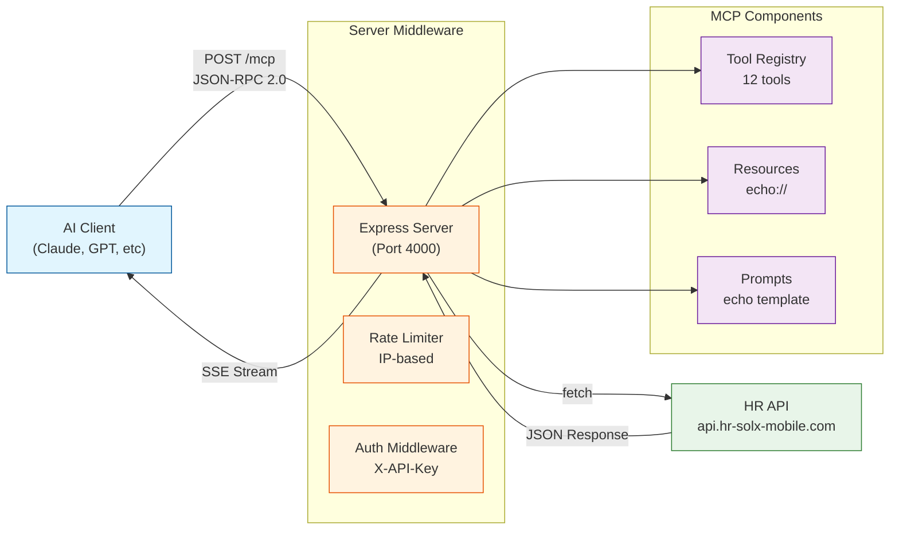
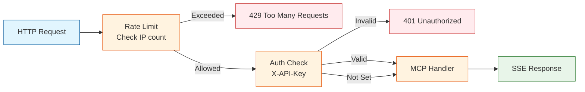
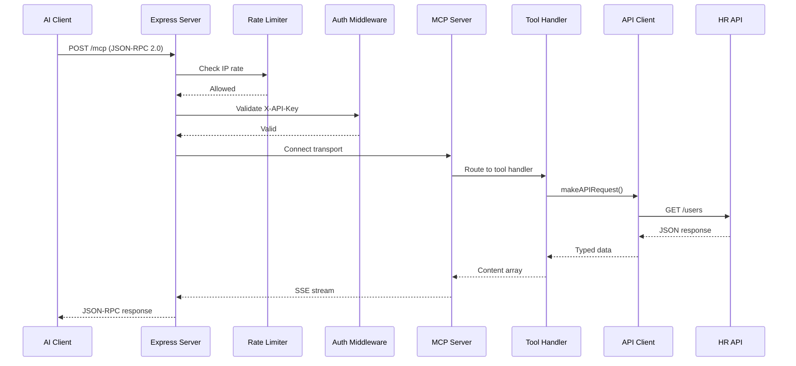
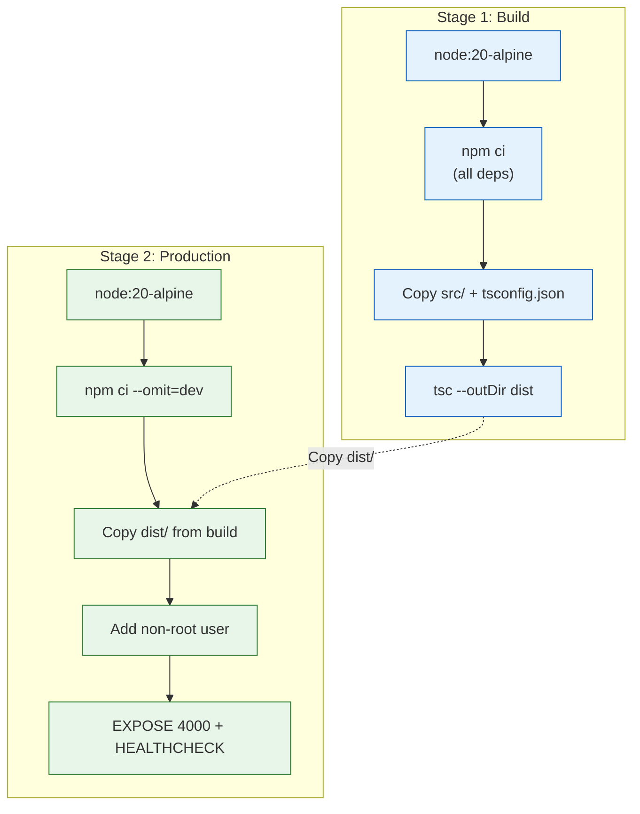
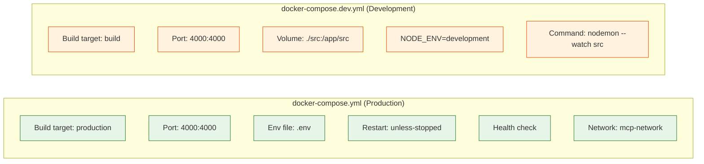

# Architecture

## Overview

This project is a **Model Context Protocol (MCP) server** that acts as a bridge between AI models and a REST API (`api.hr-solx-mobile.com`). It exposes HR-related endpoints as MCP tools that AI clients can discover and invoke.

## System Architecture



## Components

### 1. Express Server (`src/index.ts`)
- HTTP server handling `/mcp` endpoint
- Supports POST (primary), GET, DELETE methods
- Stateless mode — no session management
- Runs on configurable port (default: 4000)
- Applies middleware chain: rate limiting → authentication → handler

### 2. MCP Server (`@modelcontextprotocol/sdk`)
- Implements Model Context Protocol specification
- Registers tools, resources, and prompts
- Handles JSON-RPC 2.0 message routing
- Uses Streamable HTTP transport

### 3. API Client (`src/client/api-client.ts`)
- Generic HTTP client for upstream API
- Handles GET and POST requests
- Returns typed responses via generics
- Error handling with typed errors (`APIError`, `NetworkError`)
- Supports optional Bearer token authentication

### 4. Tool Registry (`src/tools/`)
- 12 registered tools mapping to API endpoints
- Zod schemas for input validation
- TypeScript interfaces for response types
- Organized by domain: echo, health, reference, users

### 5. Middleware (`src/middleware/`)
- **Authentication** (`auth.ts`) — API key validation via `X-API-Key` header
- **Rate Limiting** (`rate-limit.ts`) — IP-based throttling with configurable limits

## Middleware Chain



## Data Flow



## Key Design Decisions

### Stateless Transport
```typescript
sessionIdGenerator: undefined
```
- No session persistence between requests
- Simpler deployment, no state management
- Each request creates fresh transport

### Modular Architecture
- Code organized by concern: types, client, tools, middleware
- Each tool module exports a registration function
- Easy to add new tools without modifying core server
- Clear separation of concerns for testing and maintenance

### Typed Error Handling
- Custom error classes: `APIError`, `NetworkError`, `ToolError`
- Structured error logging with context
- Descriptive error messages returned to AI clients

## Deployment

### Docker Architecture



**Production image features:**
- **Base image:** Node 20 Alpine (~180MB final)
- **No dev dependencies:** ts-node, nodemon, typescript excluded
- **Non-root user:** Security best practice
- **Health check:** HTTP check to `/mcp` endpoint
- **Restart policy:** `unless-stopped`

**Development setup:**
- Volume mount: `./src:/app/src` for live editing
- Hot-reload via nodemon (watches `src/` directory)
- Debug logging enabled by default

### Container Orchestration



## Configuration

| Variable | Default | Purpose |
|----------|---------|---------|
| `MCP_SERVER_PORT` | `4000` | Server listening port |
| `MCP_API_URL` | `https://api.hr-solx-mobile.com` | Upstream API base URL |
| `MCP_API_KEY` | — | API key for MCP endpoint auth |
| `API_TOKEN` | — | Bearer token for upstream API |
| `RATE_LIMIT_WINDOW_MS` | `900000` | Rate limit window (15 min) |
| `RATE_LIMIT_MAX_REQUESTS` | `100` | Max requests per window |
| `DEBUG` | `mcp:*` | Debug logging for MCP SDK |

## Dependencies

| Package | Version | Purpose |
|---------|---------|---------|
| `@modelcontextprotocol/sdk` | ^1.26.0 | MCP protocol implementation |
| `express` | ^5.2.1 | HTTP server framework |
| `zod` | ^4.3.6 | Schema validation |
| `node-fetch` | ^3.3.2 | HTTP client (fallback) |
| `typescript` | ^5.2.2 | Type checking |
| `ts-node` | ^10.9.2 | Direct TS execution / dev |
| `nodemon` | ^3.1.0 | File watching (dev) |
