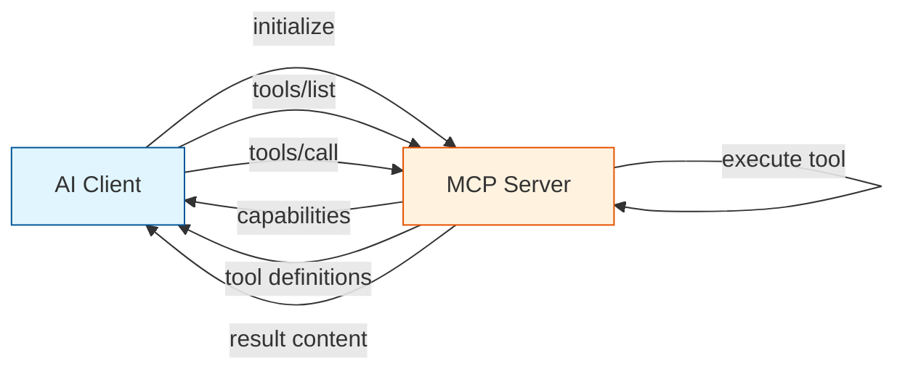
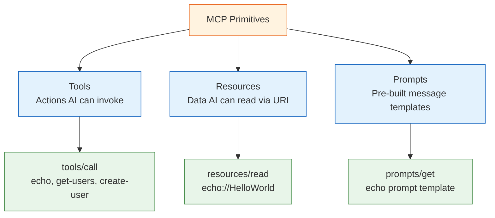
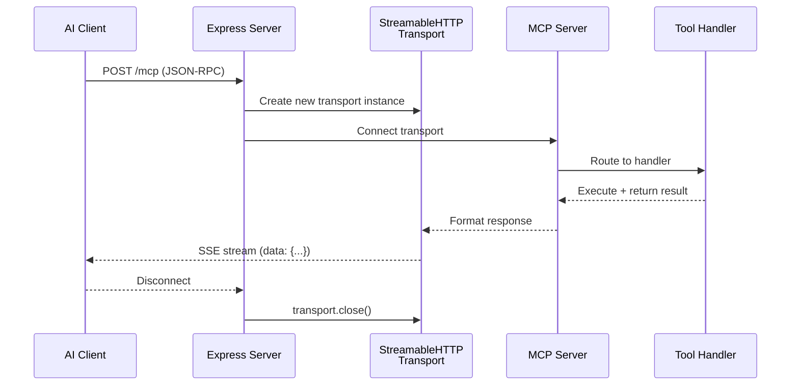

# MCP Protocol Guide

## What is MCP?

The **Model Context Protocol (MCP)** is an open standard that allows AI models to interact with external tools, resources, and data sources. It provides a standardized way for AI clients to:

- Discover available capabilities
- Invoke tools with parameters
- Access resources
- Use predefined prompts

## Protocol Overview



## Protocol Basics

### JSON-RPC 2.0

All MCP communication uses [JSON-RPC 2.0](https://www.jsonrpc.org/specification):

```json
{
  "jsonrpc": "2.0",
  "method": "tools/call",
  "params": {
    "name": "get-users",
    "arguments": {}
  },
  "id": 1
}
```

**Fields:**
- `jsonrpc`: Always `"2.0"`
- `method`: The operation to perform
- `params`: Method-specific parameters
- `id`: Unique request identifier (matched in response)

### Response Format

**Success:**
```json
{
  "jsonrpc": "2.0",
  "result": {
    "content": [
      { "type": "text", "text": "Users: John, Jane, Bob" }
    ]
  },
  "id": 1
}
```

**Error:**
```json
{
  "jsonrpc": "2.0",
  "error": {
    "code": -32603,
    "message": "Internal server error"
  },
  "id": 1
}
```

## MCP Primitives



### 1. Tools

Tools are **actions** that AI models can invoke with parameters.

**Registration:**
```typescript
server.tool(
  "echo",                          // Tool name
  { message: z.string() },         // Parameter schema (Zod)
  async ({ message }) => ({        // Handler function
    content: [{ type: "text", text: `Tool echo: ${message}` }]
  })
);
```

**Invocation:**
```json
{
  "jsonrpc": "2.0",
  "method": "tools/call",
  "params": {
    "name": "echo",
    "arguments": { "message": "Hello!" }
  },
  "id": 1
}
```

**Response:**
```json
{
  "jsonrpc": "2.0",
  "result": {
    "content": [{ "type": "text", "text": "Tool echo: Hello!" }]
  },
  "id": 1
}
```

### 2. Resources

Resources are **data** that AI models can read via URI templates.

**Registration:**
```typescript
server.resource(
  "echo",
  new ResourceTemplate("echo://{message}", { list: undefined }),
  async (uri, { message }) => ({
    contents: [{
      uri: uri.href,
      text: `Resource echo: ${message}`
    }]
  })
);
```

**Access:**
```json
{
  "jsonrpc": "2.0",
  "method": "resources/read",
  "params": { "uri": "echo://HelloWorld" },
  "id": 2
}
```

### 3. Prompts

Prompts are **pre-built message templates** for AI interactions.

**Registration:**
```typescript
server.prompt(
  "echo",
  { message: z.string() },
  ({ message }) => ({
    messages: [{
      role: "user",
      content: {
        type: "text",
        text: `Please process this message: ${message}`
      }
    }]
  })
);
```

## Transport: Streamable HTTP

This project uses **Streamable HTTP Transport** — the modern MCP transport method.

### How It Works



### Key Characteristics

- **Stateless**: `sessionIdGenerator: undefined` means no sessions
- **Per-request transport**: New transport instance for each request
- **SSE responses**: Server-Sent Events for streaming
- **Clean shutdown**: Transport closes on client disconnect

### Implementation

```typescript
app.post('/mcp', async (req: Request, res: Response) => {
  const transport = new StreamableHTTPServerTransport({
    sessionIdGenerator: undefined,  // Stateless mode
  });
  
  res.on('close', () => {
    transport.close();  // Cleanup on disconnect
  });
  
  await server.connect(transport);
  await transport.handleRequest(req, res, req.body);
});
```

## Common MCP Methods

| Method | Purpose |
|--------|---------|
| `initialize` | Establish connection, negotiate capabilities |
| `tools/list` | List all available tools |
| `tools/call` | Invoke a specific tool |
| `resources/list` | List available resources |
| `resources/read` | Read a resource by URI |
| `prompts/list` | List available prompts |
| `prompts/get` | Get a prompt with parameters |
| `mcp.list_capabilities` | List server capabilities |

## Testing with curl

### List Tools
```bash
curl -X POST http://localhost:4000/mcp \
  -H "Content-Type: application/json" \
  -H "Accept: application/json, text/event-stream" \
  -d '{"jsonrpc":"2.0","method":"tools/list","params":{},"id":1}'
```

### Call a Tool
```bash
curl -X POST http://localhost:4000/mcp \
  -H "Content-Type: application/json" \
  -H "Accept: application/json, text/event-stream" \
  -d '{"jsonrpc":"2.0","method":"tools/call","params":{"name":"echo","arguments":{"message":"Hello"}},"id":1}'
```

### List Capabilities
```bash
curl -X POST http://localhost:4000/mcp \
  -H "Content-Type: application/json" \
  -H "Accept: application/json, text/event-stream" \
  -d '{"jsonrpc":"2.0","method":"mcp.list_capabilities","params":{},"id":1}'
```

## Error Codes

| Code | Meaning |
|------|---------|
| `-32700` | Parse error (invalid JSON) |
| `-32600` | Invalid Request |
| `-32601` | Method not found |
| `-32602` | Invalid params |
| `-32603` | Internal error |
| `-32000` | Server error (custom) |
