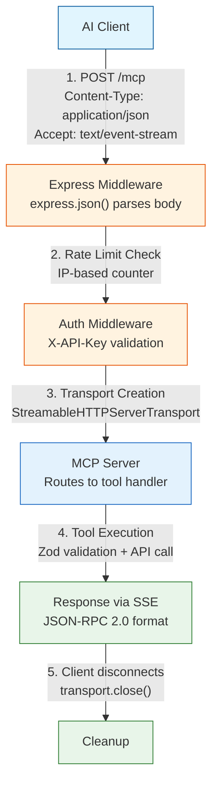
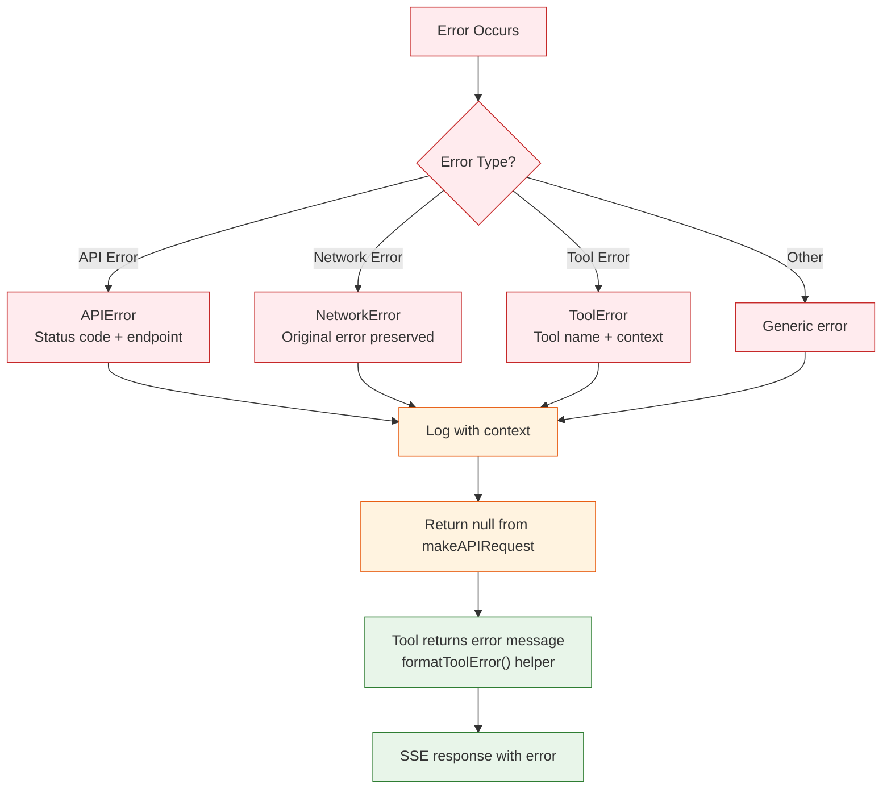

# Request Flow

This document traces the complete lifecycle of an MCP request through the server.

## High-Level Flow



## Detailed Step-by-Step

### Step 1: Client Sends Request

```json
POST /mcp HTTP/1.1
Host: localhost:4000
Content-Type: application/json
Accept: application/json, text/event-stream

{
  "jsonrpc": "2.0",
  "method": "tools/call",
  "params": {
    "name": "get-users",
    "arguments": {}
  },
  "id": 1
}
```

### Step 2: Express Receives Request

**File:** `src/index.ts:53`

```typescript
app.post('/mcp', async (req: Request, res: Response) => {
```

- Express middleware (`express.json()`) has already parsed the body
- `req.body` contains the parsed JSON object

### Step 3: Request Logging

**File:** `src/index.ts:56`

```typescript
console.log('Received request:', JSON.stringify(req.body, null, 2));
```

Full request body logged to console for debugging.

### Step 4: Transport Creation

**File:** `src/index.ts:58-65`

```typescript
const transport = new StreamableHTTPServerTransport({
  sessionIdGenerator: undefined,  // Stateless mode
});

res.on('close', () => {
  console.log('Request closed');
  transport.close();
});
```

Key points:
- New transport instance per request
- No session ID generated (stateless)
- Cleanup handler registered for disconnect

### Step 5: MCP Server Connection

**File:** `src/index.ts:67-68`

```typescript
await server.connect(transport);
await transport.handleRequest(req, res, req.body);
```

- MCP server connects to the transport
- Transport handles the JSON-RPC request
- Routes to appropriate tool handler based on `method` and `params.name`

### Step 6: Tool Execution

**File:** `src/index.ts:319-331` (example: get-users)

```typescript
server.tool(
  "get-users",
  "List users",
  {},
  async () => {
    const users = await makeAPIRequest<User[]>(`${API_URL}/users`);
    if (!users) {
      return { content: [{ type: "text", text: "Failed to retrieve users." }] };
    }
    return { content: [{ type: "text", text: `Users: ${users.map(u => u.name).join(", ")}` }] };
  },
);
```

Execution flow:
1. MCP server finds tool by name (`get-users`)
2. Validates arguments against schema (empty `{}` = no params)
3. Calls handler function
4. Handler calls `makeAPIRequest()` to upstream API
5. Formats response as MCP content array

### Step 6a: API Request

**File:** `src/index.ts:118-137`

```typescript
async function makeAPIRequest<T>(url: string, method: string = 'GET', body?: any): Promise<T | null> {
  const headers = {
    "Content-Type": "application/json",
  };

  try {
    const response = await fetch(url, {
      method,
      headers,
      body: body ? JSON.stringify(body) : undefined,
    });
    if (!response.ok) {
      throw new Error(`HTTP error! status: ${response.status}`);
    }
    return (await response.json()) as T;
  } catch (error) {
    console.error("Error making API request:", error);
    return null;
  }
}
```

### Step 7: Response Streaming

The transport sends the response as Server-Sent Events:

```
data: {"jsonrpc":"2.0","result":{"content":[{"type":"text","text":"Users: John, Jane, Bob"}]},"id":1}
```

Client parses SSE format to extract JSON response.

### Step 8: Cleanup

When client disconnects:

```typescript
res.on('close', () => {
  console.log('Request closed');
  transport.close();
});
```

Transport resources are released.

## Error Flow



If an error occurs at any step:

```typescript
catch (error) {
  console.error('Error handling MCP request:', error);
  if (!res.headersSent) {
    res.status(500).json({
      jsonrpc: '2.0',
      error: {
        code: -32603,
        message: 'Internal server error',
      },
      id: null,
    });
  }
}
```

- Error logged to console
- JSON-RPC error response sent (if headers not already sent)
- Transport still cleaned up via `close` handler
